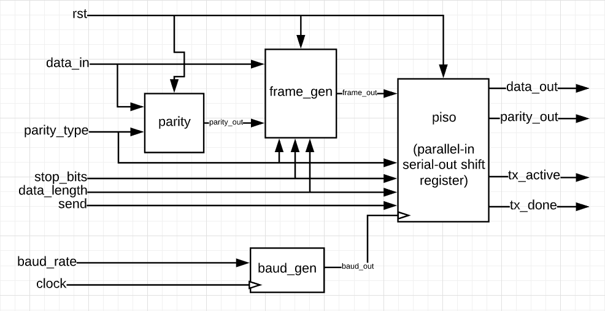

# UART Transmitter (TX) Implementation in Verilog

## Overview

This project implements a **Universal Asynchronous Receiver Transmitter (UART) Transmitter (TX)** module using **Verilog**. This was part of the Chipions23 Program provided by IEEE SSCS AUSC.

## Features

- Configurable data width (7 or 8 bits)
- Optional parity support (None, Even, Odd, Parallel Odd)
- 1 or 2 stop bits
- Baud rate generator with selectable speeds
- Modular design with separate Verilog components
- Testbenches for all modules with simulation outputs

## Architecture

## Modules

### 1. `parity.v`

Generates a parity bit based on the selected parity type:
- None (`2'b00`)
- Odd (`2'b01`)
- Even (`2'b10`)
- Parallel Odd (`2'b11`)

### 2. `frame_gen.v`

Builds the UART data frame, including:
- Start bit
- Data bits
- Parity bit (if enabled)
- Stop bit(s)

### 3. `baud_gen.v`

Generates baud clock signal based on selected baud rate:
- 2400 baud
- 4800 baud
- 9600 baud
- 19200 baud

### 4. `piso.v` (Parallel-In Serial-Out)

Shifts out the full UART frame bit-by-bit using the generated baud clock. Outputs:
- `data_out`: serialized TX data
- `tx_active`: transmission in progress
- `tx_done`: transmission complete
- `P_parity_out`: parallel parity out

### 5. `uart_tx.v`

Top-level module integrating all components. Interfaces:
- **Inputs**: clock, reset, send signal, data, baud rate, parity type, stop bits, data length
- **Outputs**: serial TX (`data_out`), status flags

## Testbenches

This implementation includes a dedicated testbench for each module and for the top module:
- Verifies functional correctness
- Simulates edge cases and configuration variations
- Displays UART frame structure and output waveform results

## Documentation
Please refer to `UartTx.pdf` for a more detailed documentation.

## Usage

1. Clone the repository.
2. Open your preferred Verilog simulation tool (ModelSim, Vivado, etc.).
3. Compile the source files and run the testbenches.
4. Adjust parameters like baud rate and data length for your use case.
